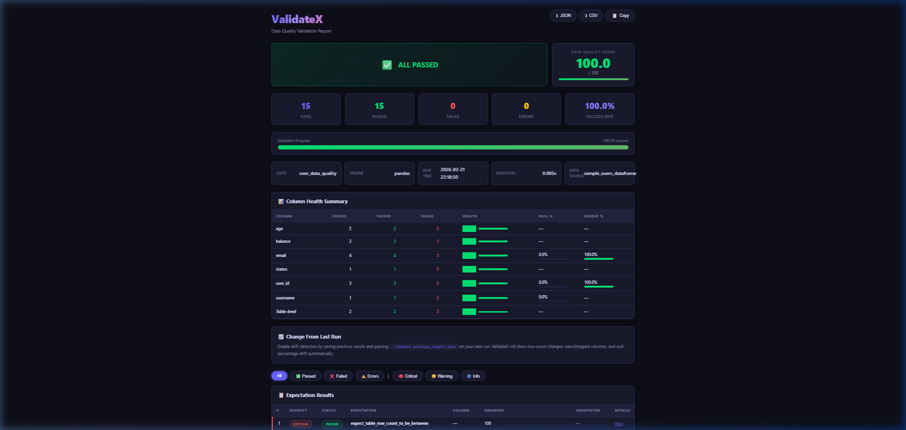
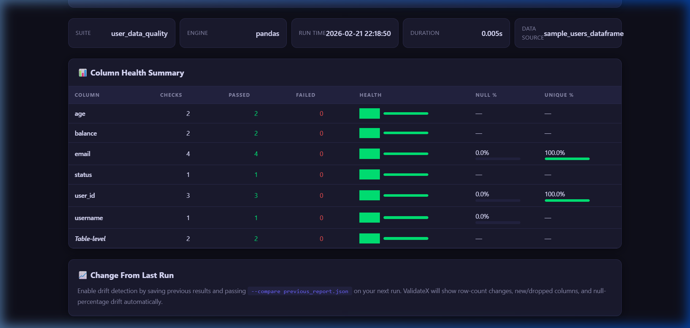
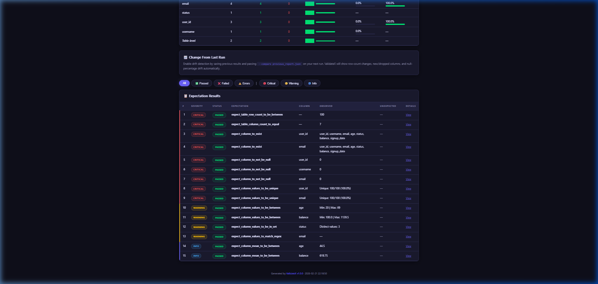

<p align="center">
  <h1 align="center">🚀 ValidateX</h1>
  <p align="center">
    <strong>A powerful, extensible data quality validation framework for Python.</strong>
  </p>
  <p align="center">
    
    
    
    
    
    
    
  </p>
</p>

ValidateX provides a comprehensive suite of tools for validating, profiling, and monitoring data quality across **Pandas** and **PySpark** DataFrames. Inspired by Great Expectations, it offers a simpler, more focused approach with modern, production-ready HTML reports and an intuitive API.

---

## 🖼️ Report Preview

<p align="center">
  
</p>

<table>
  <tr>
    <td width="50%">
      
      <p align="center"><em>Column Health Summary with mini bar charts</em></p>
    </td>
    <td width="50%">
      
      <p align="center"><em>Severity-tagged Expectations with human-readable output</em></p>
    </td>
  </tr>
</table>

---

## 🤔 Why ValidateX?

| Feature | **ValidateX** | **Great Expectations** |
|---|---|---|
| **Setup** | `pip install` → validate in 5 lines | Multi-step setup with contexts & stores |
| **API** | Fluent, chainable Python API | Heavy config system |
| **Severity levels** | ✔ (Critical, Warning, Info) | ❌ |
| **Quality score** | ✔ (Weighted 0–100) | ❌ |
| **Auto-suggest expectations**| ✔ | ✔ |
| **Reports** | Modern dark-theme HTML with minicharts | Basic data docs |
| **Output Data Types** | Clean native Python types | NumPy types leak into JSON |
| **PySpark Support** | ✔ | ✔ |
| **Polars Support** | Soon | ✔ |
| **CI/CD friendly CLI** | ✔ | ❌ |
| **Downloads** | JSON / CSV / clipboard built into report | Separate export |
| **Learning curve** | Minutes | Hours to days |

ValidateX is not a replacement for Great Expectations — it's a **focused alternative** for teams that want production-grade data validation without the overhead.

---

## 🎯 Who Is This For?

- **Startup data teams** — Ship data quality checks in minutes, not days
- **ML engineers** — Validate feature stores and training data before model runs
- **CI/CD pipelines** — Gate deployments on data quality with a single CLI command
- **Analytics teams** — Catch data issues before they reach dashboards
- **dbt users** — Lightweight validation alongside your transformation layer
- **Data platform teams** — Monitor data quality across dozens of tables

---

## ✨ Features

| Feature | Description |
|---------|-------------|
| **25+ Built-in Expectations** | Column-level, table-level, and aggregate validations |
| **Dual Engine Support** | Pandas and PySpark execution engines |
| **🎯 Data Quality Score** | Weighted score (0–100) based on severity of checks |
| **🔴🟡🔵 Severity Levels** | Critical / Warning / Info classification for every expectation |
| **📊 Column Health Summary** | At-a-glance per-column health with mini bar charts |
| **Modern HTML Reports** | Stunning, self-contained dark-theme reports with animations |
| **📥 Download Buttons** | Export reports as JSON, CSV, or copy summary to clipboard |
| **📈 Drift Detection** | Track changes between validation runs |
| **Data Profiling** | Auto-analyse datasets and suggest expectations |
| **YAML/JSON Config** | Define expectations declaratively |
| **CLI Interface** | Run validations from the command line |
| **Checkpoint System** | Tie data sources and suites together |
| **Extensible** | Create custom expectations with the registry pattern |
| **Clean Output** | All values are native Python types — zero NumPy leakage |

---

## 📦 Installation

```bash
# Basic install
pip install -e .

# With PySpark support
pip install -e ".[spark]"

# With database support
pip install -e ".[database]"

# Full install
pip install -e ".[all]"

# Development
pip install -e ".[dev]"
```

---

## 🏁 Quick Start

### Python API

```python
import pandas as pd
import validatex as vx

# Create your data
df = pd.DataFrame({
    "user_id": [1, 2, 3, 4, 5],
    "name": ["Alice", "Bob", "Charlie", "Diana", "Eve"],
    "age": [25, 30, 35, 28, 42],
    "email": ["alice@test.com", "bob@test.com", "charlie@test.com",
              "diana@test.com", "eve@test.com"],
    "status": ["active", "active", "inactive", "active", "pending"],
})

# Build an expectation suite
suite = (
    vx.ExpectationSuite("user_quality")
    .add("expect_column_to_not_be_null", column="user_id")
    .add("expect_column_values_to_be_unique", column="user_id")
    .add("expect_column_values_to_be_between", column="age", min_value=0, max_value=150)
    .add("expect_column_values_to_be_in_set",
         column="status", value_set=["active", "inactive", "pending"])
    .add("expect_column_values_to_match_regex",
         column="email", regex=r"^[\w.]+@[\w]+\.\w+$")
)

# Validate
result = vx.validate(df, suite)

# Print summary (includes Quality Score)
print(result.summary())

# Generate reports
result.to_html("report.html")
result.to_json_file("report.json")
```

### CLI

```bash
# Initialize a project
validatex init

# Profile a dataset
validatex profile --data data.csv --suggest --output auto_suite.yaml

# Run validation
validatex validate --data data.csv --suite suite.yaml --report report.html

# Run checkpoint
validatex run --checkpoint checkpoint.yaml

# List available expectations
validatex list-expectations
```

---

## 🤖 Automate with CI/CD

ValidateX is designed to be lightweight and CI-friendly. You can easily integrate it into your GitHub Actions, GitLab CI, or Jenkins pipelines to gate deployments on data quality.

**Example: GitHub Actions**
```yaml
name: Data Quality Validation
on: [push, pull_request]

jobs:
  validate-data:
    runs-on: ubuntu-latest
    steps:
      - uses: actions/checkout@v4
      
      - name: Set up Python
        uses: actions/setup-python@v5
        with:
          python-version: '3.11'
          
      - name: Install ValidateX
        run: pip install validatex
        
      - name: Run Data Validation
        run: |
          validatex validate \
            --data data/production_data.csv \
            --suite tests/data_quality/suite.yaml \
            --report dq_report.html
            
      - name: Archive production artifacts
        uses: actions/upload-artifact@v4
        if: always()
        with:
          name: validatex-report
          path: dq_report.html
```

---

## 🎯 Data Quality Score

ValidateX computes a **weighted quality score** (0–100) based on the severity of each expectation:

| Severity | Weight | Example Expectations |
|----------|--------|---------------------|
| 🔴 **Critical** | ×3 | Null checks, uniqueness, column existence, row count |
| 🟡 **Warning** | ×2 | Range checks, set membership, regex, type checks |
| 🔵 **Info** | ×1 | Mean/stdev bounds, string lengths, distinct values |

**Formula:** `Score = 100 × (weighted_passed / weighted_total)`

A critical failure impacts the score 3× more than an info-level check. This gives decision-makers a **single number** to assess data health.

```python
result = vx.validate(df, suite)
score = result.compute_quality_score()
print(f"Data Quality Score: {score}/100")
```

### Custom Severity

Override the default severity on any expectation via meta:

```yaml
expectations:
  - expectation_type: expect_column_mean_to_be_between
    column: revenue
    kwargs:
      min_value: 1000
      max_value: 50000
    meta:
      severity: critical   # Override default "info" → "critical"
```

---

## 📊 Column Health Summary

The HTML report includes a **Column Health Summary** that aggregates all expectations per column:

| Column | Checks | Passed | Failed | Health | Null % | Unique % |
|--------|--------|--------|--------|--------|--------|----------|
| user_id | 3 | 3 | 0 | 100% ███ | 0.0% | 100.0% ███ |
| email | 4 | 4 | 0 | 100% ███ | 0.0% | 100.0% ███ |
| status | 1 | 1 | 0 | 100% ███ | — | — |

Each metric includes a **mini CSS bar chart** for instant visual scanning.

```python
for col in result.column_health():
    print(f"{col.column}: {col.health_score}% health, "
          f"{col.passed}/{col.checks} passed")
```

---

## 📋 Available Expectations

### Column-Level (16)
| Expectation | Severity | Description |
|------------|----------|-------------|
| `expect_column_to_exist` | 🔴 Critical | Column exists in DataFrame |
| `expect_column_to_not_be_null` | 🔴 Critical | No null values |
| `expect_column_values_to_be_unique` | 🔴 Critical | All values unique |
| `expect_column_values_to_be_between` | 🟡 Warning | Values within range |
| `expect_column_values_to_be_in_set` | 🟡 Warning | Values in allowed set |
| `expect_column_values_to_not_be_in_set` | 🟡 Warning | Values not in forbidden set |
| `expect_column_values_to_match_regex` | 🟡 Warning | Values match regex pattern |
| `expect_column_values_to_be_of_type` | 🟡 Warning | Column dtype matches |
| `expect_column_values_to_be_dateutil_parseable` | 🟡 Warning | Values parseable as dates |
| `expect_column_value_lengths_to_be_between` | 🔵 Info | String lengths within range |
| `expect_column_max_to_be_between` | 🔵 Info | Column max within bounds |
| `expect_column_min_to_be_between` | 🔵 Info | Column min within bounds |
| `expect_column_mean_to_be_between` | 🔵 Info | Column mean within bounds |
| `expect_column_stdev_to_be_between` | 🔵 Info | Column std dev within bounds |
| `expect_column_distinct_values_to_be_in_set` | 🔵 Info | All distinct values in set |
| `expect_column_proportion_of_unique_values_to_be_between` | 🔵 Info | Uniqueness ratio in range |

### Table-Level (5)
| Expectation | Severity | Description |
|------------|----------|-------------|
| `expect_table_row_count_to_equal` | 🔴 Critical | Exact row count |
| `expect_table_row_count_to_be_between` | 🔴 Critical | Row count in range |
| `expect_table_columns_to_match_ordered_list` | 🔴 Critical | Column order matches |
| `expect_table_columns_to_match_set` | 🔴 Critical | Column names match (unordered) |
| `expect_table_column_count_to_equal` | 🔴 Critical | Exact column count |

### Aggregate / Cross-Column (4)
| Expectation | Severity | Description |
|------------|----------|-------------|
| `expect_column_pair_values_a_to_be_greater_than_b` | 🟡 Warning | Column A > Column B |
| `expect_column_pair_values_to_be_equal` | 🟡 Warning | Two columns equal |
| `expect_multicolumn_sum_to_equal` | 🟡 Warning | Row-wise sum equals target |
| `expect_compound_columns_to_be_unique` | 🔴 Critical | Compound key uniqueness |

---

## 📊 Data Profiling

```python
import pandas as pd
from validatex import DataProfiler

df = pd.read_csv("data.csv")
profiler = DataProfiler()

# Profile
profile = profiler.profile(df)
print(profile.summary())

# Auto-suggest expectations
suite = profiler.suggest_expectations(df, suite_name="auto_suite")
suite.save("auto_suite.yaml")
```

---

## 🔧 YAML Suite Configuration

```yaml
suite_name: my_data_quality
meta:
  description: "Quality checks for production data"

expectations:
  - expectation_type: expect_column_to_not_be_null
    column: id
    meta:
      severity: critical

  - expectation_type: expect_column_values_to_be_between
    column: age
    kwargs:
      min_value: 0
      max_value: 150

  - expectation_type: expect_column_values_to_be_in_set
    column: status
    kwargs:
      value_set: ["active", "inactive"]
```

---

## 🏗️ Architecture

```
validatex/
├── core/
│   ├── expectation.py     # Base class + registry
│   ├── result.py          # ValidationResult, QualityScore, Severity, ColumnHealth
│   ├── suite.py           # ExpectationSuite (fluent API)
│   └── validator.py       # Validation orchestrator
├── expectations/
│   ├── column_expectations.py     # 16 column-level checks
│   ├── table_expectations.py      # 5 table-level checks
│   └── aggregate_expectations.py  # 4 cross-column checks
├── datasources/
│   ├── csv_source.py      # CSV files
│   ├── parquet_source.py  # Parquet files
│   ├── database_source.py # SQL databases (SQLAlchemy)
│   └── dataframe_source.py # Direct DataFrames
├── profiler/
│   └── profiler.py        # Auto-profiling & suggestion engine
├── reporting/
│   ├── html_report.py     # Production HTML reports
│   └── json_report.py     # JSON reports
├── config/
│   └── loader.py          # YAML/JSON config loading
└── cli/
    └── main.py            # CLI (validate, run, profile, init, list-expectations)
```

---

## 🧪 Testing

```bash
# Run all tests (66 tests)
pytest tests/ -v

# Run with coverage
pytest tests/ -v --cov=validatex --cov-report=html

# Unit tests only
pytest tests/unit/ -v

# Integration tests
pytest tests/integration/ -v
```

---

## 🤝 Creating Custom Expectations

```python
from dataclasses import dataclass, field
from validatex.core.expectation import Expectation, register_expectation
from validatex.core.result import ExpectationResult

@register_expectation
@dataclass
class ExpectColumnValuesToBePositive(Expectation):
    """Expect all values in a numeric column to be positive."""

    expectation_type: str = field(
        init=False, default="expect_column_values_to_be_positive"
    )

    def _validate_pandas(self, df) -> ExpectationResult:
        series = df[self.column].dropna()
        total = len(series)
        negative_mask = series <= 0
        unexpected_count = int(negative_mask.sum())
        pct = (unexpected_count / total * 100) if total > 0 else 0.0

        return self._build_result(
            success=(unexpected_count == 0),
            element_count=total,
            unexpected_count=unexpected_count,
            unexpected_percent=pct,
            unexpected_values=series[negative_mask].tolist()[:20],
        )
```

---

## 🧹 Clean Output

ValidateX converts all internal types to native Python before rendering. You'll never see `np.int64(20)` in reports or JSON — only clean `20`.

```python
result = vx.validate(df, suite)
data = result.to_dict()

# Observed values are always clean:
# {'min': 20, 'max': 69}        ← NOT {'min': np.int64(20), ...}
# "Unique: 100/100 (100.0%)"    ← NOT "100 unique out of 100"
# "Distinct values: 3"          ← NOT "{'unique_values': 3}"
```

---

## 🚀 Roadmap

- [x] 25+ built-in expectations (column, table, aggregate)
- [x] Pandas + PySpark dual-engine support
- [x] Severity modeling (Critical / Warning / Info)
- [x] Weighted data quality score (0–100)
- [x] Column health summary with mini charts
- [x] Modern HTML reports with dark theme
- [x] Download buttons (JSON, CSV, clipboard)
- [x] Drift detection foundation
- [x] Data profiler with auto-suggestion
- [x] CLI with validate, profile, run, init commands
- [x] YAML/JSON declarative configuration
- [x] Native Python type sanitization
- [ ] Slack / Teams notifications on failure
- [ ] GitHub Action template for CI/CD
- [ ] Polars engine support
- [ ] Baseline history tracking & trend charts
- [ ] Anomaly detection expectations
- [ ] Great Expectations suite import/migration
- [ ] Web dashboard for multi-dataset monitoring
- [ ] dbt integration plugin

---

## 📄 License

MIT License

---

<p align="center">
  <strong>Built with ❤️ by the ValidateX Team</strong>
  <br>
  <sub>If this project helps you, consider giving it a ⭐</sub>
</p>
